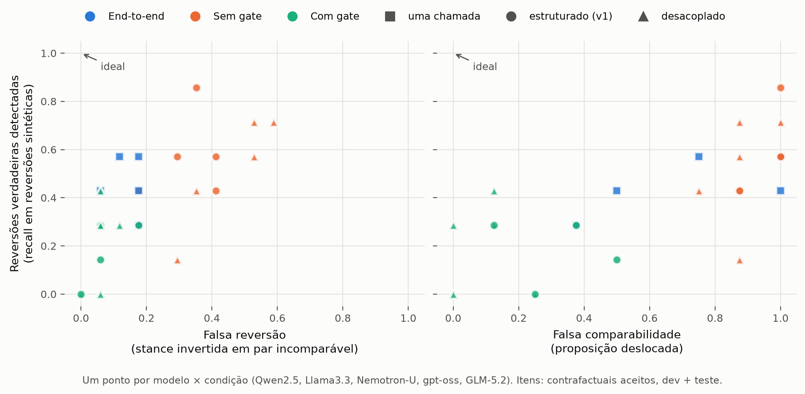

# Gate desacoplado e modelos maiores: o trade-off se repete

**Resumo.** Em 5 modelos de 4 famílias, com três formas de produzir a relação, os pontos se agrupam pela **condição** (com gate, sem gate, end-to-end), e não pelo modelo:
- nenhum modelo nem condição combina alto recall de reversões com poucas falsas reversões e pouca falsa comparabilidade;
- modelos maiores mudam a posição de cada ponto ao longo da curva, mas não quebram o trade-off.

Rodada de 2026-09-28: 1.476 respostas, custo real **US$ 2,58**. Nenhuma anotação humana nova.



## Desenho

**Itens:** os mesmos de antes.
- 47 pares do gold humano: dev = piloto (18), teste = expansão (29).
- 39 contrafactuais aceitos no estresse (`docs/stress_and_canonicalization.md`).

**Modelos:**
- os dois v1: Qwen2.5-72B e Llama-3.3-70B;
- três maiores, de famílias diferentes das do gerador (DeepSeek) e do verificador (Qwen3): GLM-5.2, NVIDIA Nemotron-3-Ultra-550B e gpt-oss-120b. Os três raciocinam antes de responder.

**Condições:**

| Código | Como a relação é produzida |
|---|---|
| A | end-to-end v1, uma chamada |
| B | estruturado v1 com comparabilidade forçada (ablação sem gate) |
| C | estruturado v1 com gate |
| D | **gate desacoplado** |
| D-forçado | a extração do desacoplado com comparabilidade forçada |

**Como funciona o gate desacoplado (D):**
- **Extração:** uma chamada por lado, que vê **só aquela fala** e devolve determinabilidade, uma pergunta neutra de sim/não e a resposta.
- **Comparação:** uma chamada que vê **só as duas perguntas**, sem falas nem respostas, e classifica em EQUIVALENT / OPPOSITE_POLARITY / DIFFERENT / UNCERTAIN.
- **Alinhamento:** OPPOSITE_POLARITY conta como mesma pergunta, com a stance de B invertida.
- **Derivação:** a relação sai de `agreement.derive_relation`, sem alteração.

**Execução:**
- Para os modelos v1, as condições A, B e C vêm dos caches das rodadas anteriores. Os modelos maiores rodaram os prompts v1 congelados, na ordem cronológica.
- Nenhum prompt foi ajustado depois de ver resultados.
- A rodada teve teto de gasto: o código para ao passar do limite.

## Resultados nos contrafactuais (k/n, dev + teste)

| Modelo | Condição | Recall de reversão ↑ | Falsa reversão em incomparáveis ↓ | Falsa comparabilidade (SHIFT) ↓ |
|---|---|---:|---:|---:|
| Qwen2.5 | A / C / **D** | 4/7 · 1/7 · **0/7** | 2/17 · 1/17 · **0/17** | 8/8 · 4/8 · **2/8** |
| Llama3.3 | A / C / **D** | 3/7 · 0/7 · **2/7** | 1/17 · 0/17 · **2/17** | 8/8 · 2/8 · **1/8** |
| Nemotron-U | A / C / **D** | 3/7 · 2/7 · **0/7** | 3/17 · 1/17 · **1/17** | 4/8 · 3/8 · **0/8** |
| gpt-oss | A / C / **D** | 4/7 · 2/7 · **2/7** | 3/17 · 1/17 · **1/17** | 6/8 · 1/8 · **0/8** |
| GLM-5.2 | A / C / **D** | 2/7 · 2/7 · **3/7** | 3/17 · 3/17 · **1/17** | 3/8 · 3/8 · **1/8** |

Sem gate (B e D-forçado), o recall de reversão sobe para 3–6/7, mas as falsas reversões vão a 3–10/17 e a falsa comparabilidade a 6–8/8. Nenhuma condição gerou mais de 1/7 de falsa reversão em NEGATED_PARAPHRASE.

## Resultados nos pares naturais (acurácia da relação)

| Modelo | A (47) | C (47) | D (47) | D, teste (29) | Recall de comparável: C → D (47) |
|---|---:|---:|---:|---:|---:|
| Qwen2.5 | 0,66 | 0,68 | 0,62 | 0,55 | 0,67 → 0,33 |
| Llama3.3 | 0,74 | 0,68 | 0,62 | 0,55 | 0,42 → 0,33 |
| Nemotron-U | 0,64 | 0,62 | 0,55 | 0,59 | 0,42 → 0,08 |
| gpt-oss | 0,64 | 0,51 | 0,57 | 0,66 | 0,42 → 0,25 |
| GLM-5.2 | 0,57* | 0,68 | 0,51 | 0,59 | 0,67 → 0,00 |

\* No GLM, 12 das 86 chamadas end-to-end (e 3 estruturadas) esgotaram o limite de 16.384 tokens só raciocinando e devolveram resposta vazia. Elas contam como erro, o que penaliza o GLM na condição A.

## Leitura

1. **O trade-off é da tarefa, não do modelo.** Na figura, as cores (condições) se separam e os modelos se misturam. Sem gate, os modelos detectam reversões, mas também inventam reversões e aceitam proposições deslocadas. Com gate, os dois erros caem, e o recall de reversão cai junto.
2. **Desacoplar remove um vazamento e cria outro.**
   - O que remove: a stance de um lado não pode mais contaminar o julgamento de comparabilidade.
   - O que cria: sem um alvo compartilhado, cada fala gera a própria pergunta, com granularidade diferente, e o comparador as considera diferentes.
   - Nos pares naturais que os humanos julgaram comparáveis, o recall cai para quase zero nos modelos maiores. Exemplo do GLM: "A vacinação contra a Covid-19 deve ser obrigatória para crianças de 6 meses a 5 anos?" × "A vacinação de crianças contra a Covid-19 deve ser obrigatória?" → DIFFERENT.
   - Além disso, a pergunta extraída de uma fala reescrita tende a carregar a própria posição ("…com cautela para não sufocar a competitividade?"), o que dificulta reconhecer a reversão.
3. **Modelos maiores são comparadores mais literais.** Nemotron e GLM quase nunca aceitam equivalência entre perguntas extraídas separadamente. Isso os deixa bons contra falsas proposições (0–1/8), mas cegos para reversões e manutenções reais.
4. **O melhor ponto é GLM-5.2 com D:** 3/7 de recall, 1/17 de falsa reversão e 1/8 de falsa comparabilidade. Com n = 7, porém, ele não se distingue dos vizinhos.
5. **Diferença entre contrafactuais e pares naturais.** Nos contrafactuais, a reescrita é guiada pela proposição-alvo do gold, o que tende a deixar a fala mais explícita sobre o alvo do que as falas naturais. É um viés conhecido de contrast sets, a ser controlado na versão ampliada.

## Implicação para o próximo passo

O resultado aponta para um **alvo compartilhado**:
- extrair a pergunta de um lado;
- perguntar ao outro lado se responde àquela mesma pergunta, e como, sem ver a fala nem a posição do primeiro.

Esse é o formato que funciona na trilha `party-alignment` (alvo fixo) e entra como condição do contrast set ampliado.

## Limitações

- n pequeno por operação (7, 7, 8, 17); os intervalos de Wilson estão em `decoupled_gate_metrics.json`.
- Contrafactuais sintéticos, verificados por um único modelo.
- Respostas vazias do GLM por esgotamento de tokens de raciocínio (ver acima).
- Os modelos v1 foram avaliados na expansão na ordem de apresentação do anotador 1, e os maiores na ordem cronológica. As relações são simétricas, mas a ordem pode influenciar.
- Uma queda de conexão durante a coleta deixou chamadas penduradas por cerca de 2 h. As execuções foram reiniciadas a partir do cache, sem chamadas duplicadas.

## Artefatos e reprodução

```
prompts/decoupled_extract_v1.txt, prompts/decoupled_compare_v1.txt
src/voxlab/decoupled_gate.py, src/voxlab/tradeoff_figure.py, tests/test_decoupled_gate.py
data/processed/decoupled_gate/decoupled_gate_predictions.csv, decoupled_gate_metrics.json
data/processed/llm_raw_outputs/decoupled/*.json      (1.476 respostas brutas)
docs/figures/gate_tradeoff.{png,pdf}
```

```bash
PYTHONPATH=src python3 -m voxlab.decoupled_gate                              # dry-run
PYTHONPATH=src python3 -m voxlab.decoupled_gate --execute --max-cost 6       # usa o cache
<python com matplotlib> src/voxlab/tradeoff_figure.py
```
